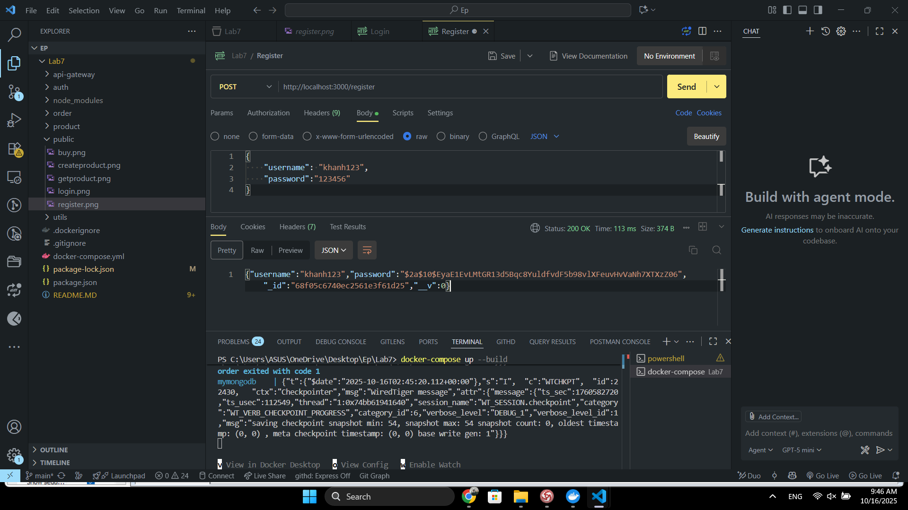
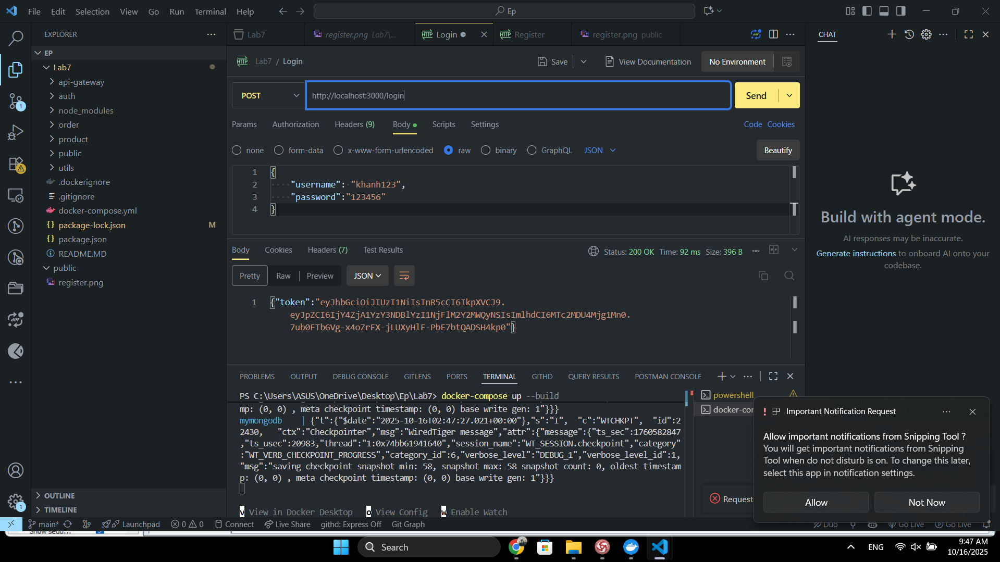
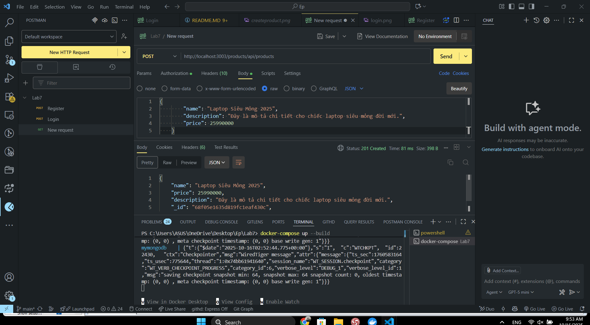
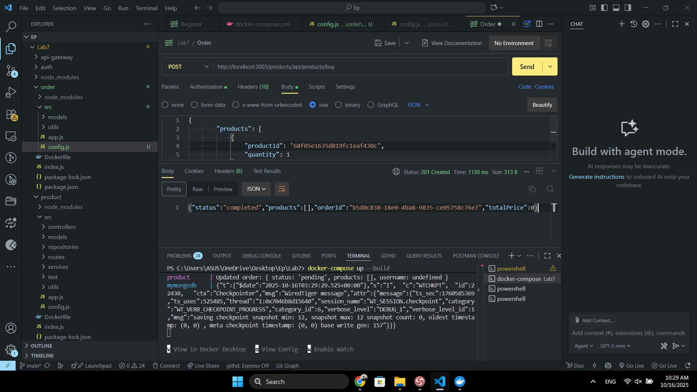

# E-Project: Hệ thống Microservices Bán hàng


### Khởi chạy hệ thống

Mở terminal ở thư mục gốc của dự án và chạy lệnh:
```bash
docker-compose up --build
```
Lệnh này sẽ build image cho từng service và khởi chạy toàn bộ hệ thống. Bạn sẽ thấy log của tất cả các service hiển thị trên màn hình.

Để dừng hệ thống, nhấn `Ctrl + C`.

---

## Kiểm tra (Testing) với Postman

Sau khi hệ thống đã chạy, bạn có thể dùng Postman để kiểm tra các API. Mọi request đều được gửi đến API Gateway tại `http://localhost:3000`.

### 1. Đăng ký tài khoản
* **Method**: `POST`
* **URL**: `http://localhost:3000/register`
* **Body** (`raw`, `JSON`):
    ```json
    {
        "username": "testuser1",
        "password": "password123"
    }
    Example:
    ```


### 2. Đăng nhập
* **Method**: `POST`
* **URL**: `http://localhost:3000/login`
* **Body** (`raw`, `JSON`):
    ```json
    {
        "username": "testuser1",
        "password": "password123"
    }
    Ecample:
    ```
    

* **Kết quả**: Copy lại giá trị `token` từ response để sử dụng cho các request tiếp theo.

### 3. Tạo sản phẩm mới
* **Method**: `POST`
* **URL**: `http://localhost:3003/products/api/products`
* **Authorization**: Chọn `Bearer Token` và dán `token` đã copy ở bước 2.
* **Body** (`raw`, `JSON`):
    ```json
    {
        "name": "Laptop Siêu Mỏng 2025",
        "description": "Đây là mô tả chi tiết cho chiếc laptop siêu mỏng đời mới.",
        "price": 25990000
    }
    ```
    
   
* **Kết quả**: Copy lại giá trị `_id` của sản phẩm vừa tạo.

### 4. Tạo đơn hàng mới
* **Method**: `POST`
* **URL**: `http://localhost:3003/products/api/products/buy` (Lưu ý: đường dẫn này có thể khác tùy theo code của bạn)
* **Authorization**: Tiếp tục dùng `Bearer Token`.
* **Body** (`raw`, `JSON`):
    ```json
    {
      "ids":"hasvhavhvchav"
    }
    ```
 

---


#


